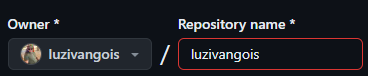
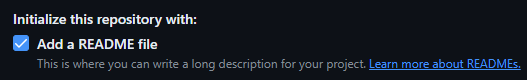
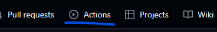
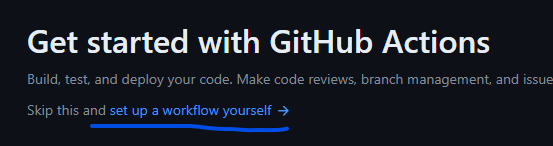
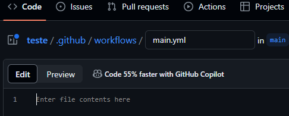
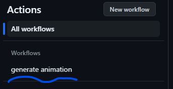
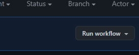

# Snake-Commits
## Passo a passo como adicionar a animação da cobrinha no seu github

### Passo 1:
Caso ainda não tenha feito, crie um repositório com o exato mesmo nome do seu usuário.
Exemplo:
> 

Deixe marcada a opção **Add a README file**:
> 

### Passo 2:
Personalize o README do seu repositório criado no Passo 1
> Sugiro seguir o vídeo da [Rafaella Ballerini](https://www.youtube.com/watch?v=TsaLQAetPLU&t) ou utilize o [GPRM](https://gprm.itsvg.in/)

### Passo 3:
No final do arquivo README do seu repositório (criado no passo 1), adicione o código abaixo:
~~~html
<picture>
  <source media="(prefers-color-scheme: dark)" srcset="https://raw.githubusercontent.com/YourUser/YourUser/output/github-contribution-grid-snake-dark.svg">
  <source media="(prefers-color-scheme: light)" srcset="https://raw.githubusercontent.com/YourUser/YourUser/output/github-contribution-grid-snake.svg">
  
</picture>
~~~

> Lembre-se de substituir no código acimar o trecho ".../YourUser/YourUser/..." pelo nome do seu usuário. Por exemplo, no meu caso ficará assim: ".../luzivangois/luzivangois/...".

### Passo 4:
Entre no seu repositório (criado no Passo 1), clique em **Actions**
> 

Agora clique em "set up a workflow yourself →"
> 

Na próxima janela o github irá criar um diretório chamado "workflows" e um arquivo "yml" chamado "main".
> 

O arquivo "main.yml" já será aberto em modo de edição, então agora você deve colar o código abaixo dentro do arquivo main e commitar ele:
~~~yml
name: generate animation

on:
  # run automatically every 24 hours
  schedule:
    - cron: "0 */24 * * *" 
  
  # allows to manually run the job at any time
  workflow_dispatch:
  
  # run on every push on the master branch
  push:
    branches:
    - master
    
  

jobs:
  generate:
    permissions: 
      contents: write
    runs-on: ubuntu-latest
    timeout-minutes: 5
    
    steps:
      # generates a snake game from a github user (<github_user_name>) contributions graph, output a svg animation at <svg_out_path>
      - name: generate github-contribution-grid-snake.svg
        uses: Platane/snk/svg-only@v3
        with:
          github_user_name: ${{ github.repository_owner }}
          outputs: |
            dist/github-contribution-grid-snake.svg
            dist/github-contribution-grid-snake-dark.svg?palette=github-dark
          
          
      # push the content of <build_dir> to a branch
      # the content will be available at https://raw.githubusercontent.com/<github_user>/<repository>/<target_branch>/<file> , or as github page
      - name: push github-contribution-grid-snake.svg to the output branch
        uses: crazy-max/ghaction-github-pages@v3.1.0
        with:
          target_branch: output
          build_dir: dist
        env:
          GITHUB_TOKEN: ${{ secrets.GITHUB_TOKEN }}

~~~

### Passo 5:
Dentro do diretório "workflows" (criado no Passo 4), clique na aba **Actions**, e sem seguinda na opção **generate animation**:
> 

Em seguinda clique no botão **Run workflow**:
> 

### Siga esses 5 passos e a sua animação vai funcionar 🐍

